<h1>
  
  <span style="vertical-align: middle;">ArtFrame</span>
</h1>

## 📱 Uygulama Hakkında
🖼️ **ArtFrame**, sanatseverlere hitap eden, zengin özelliklerle donatılmış bir mobil uygulama. Uygulama, kullanıcıların farklı sanat eserlerini ve sanatçıları keşfetmesini sağlarken, aynı zamanda her sanat eseri için detaylı bilgiler sunuyor. Kullanıcılar beğendikleri eser ve sanatçıları favorilerine ekleyebilir, sanatçılara ait tüm eserleri görebilir ve eserleri cihazlarına indirebilir, paylaşabilir veya duvar kağıdı olarak ayarlayabilir.

🎮 **Uygulamanın öne çıkan özelliklerinden biri de**, kullanıcıların sanat alanındaki genel kültürünü test edebileceği sanat eseri tahmin oyunudur. Oyunda doğru tahminlerde bulundukça, dünyaca ünlü eserleri koleksiyonunuza ekleyebilirsiniz.


## 🎯 Özellikler
- 🖼️ **Sanat Eseri Keşfi** - Geniş koleksiyon
- ❤️ **Favori Yönetimi** - Kişisel koleksiyon
- 👨‍🎨 **Sanatçı Profilleri** - Detaylı bilgiler
- 🎮 **Quiz Oyunu** - Sanat bilgi testi
- 🔍 **Tam Ekran Görüntüleme** - Zoom ve pan desteği
- 🌙 **Karanlık Tema** - Göz dostu arayüz
- 📱 **Modern UI/UX** - Material Design 3
---
## 📱 Ekran Görüntüleri

### 🎨 Artworks Ekranı
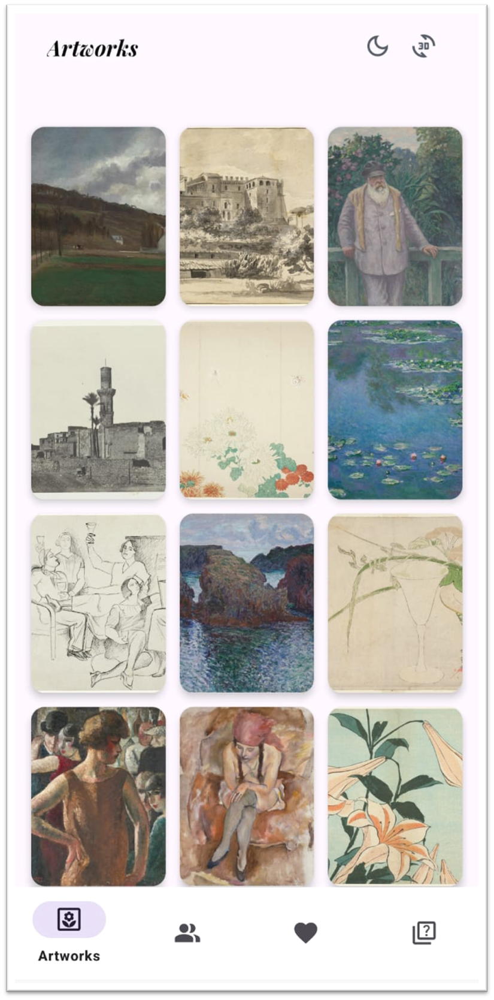 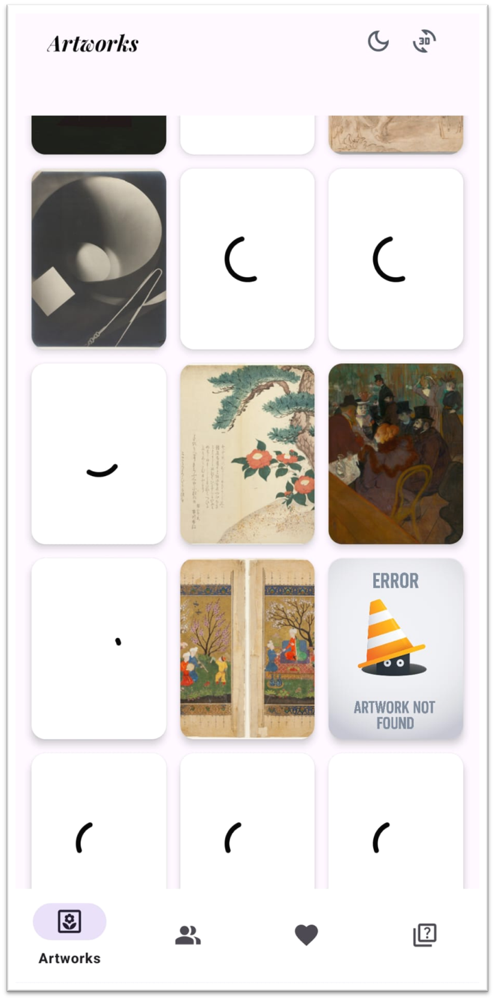

### 👩‍🎨 Artist Ekranı
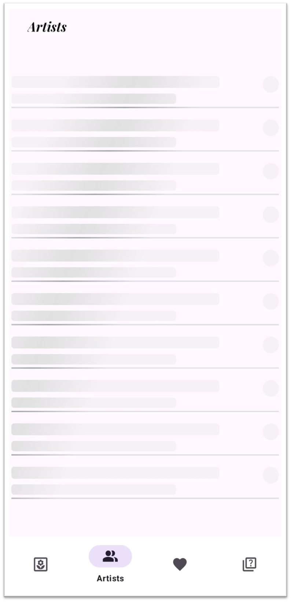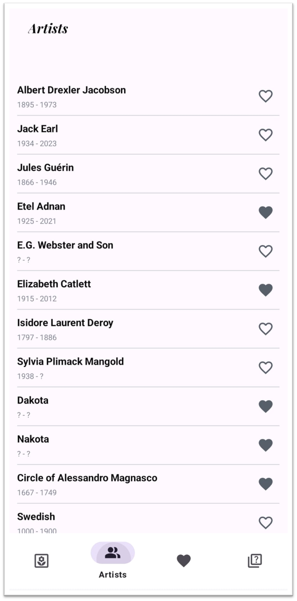

### ⭐ Favoriler Ekranı
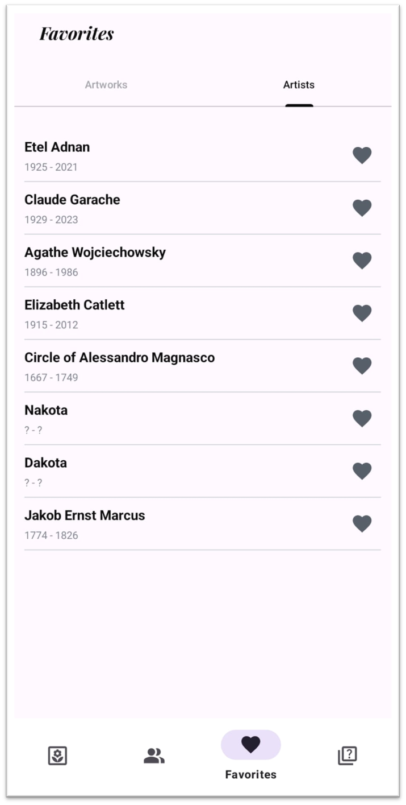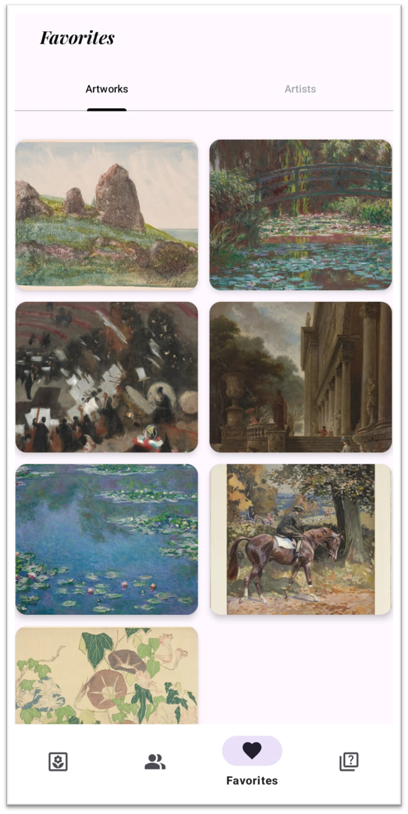
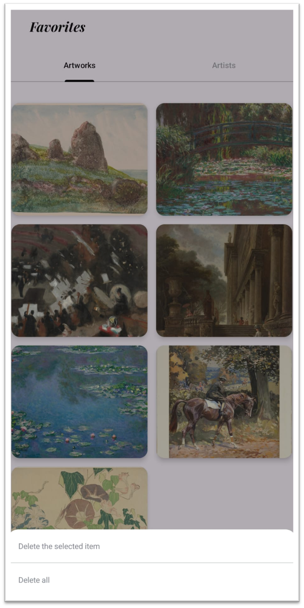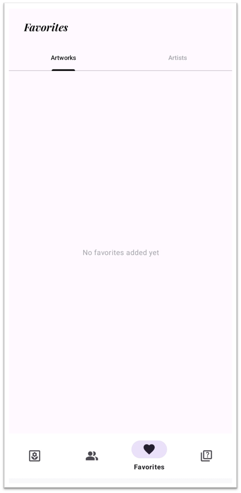

### 🎨 Artworks Detail Ekranı
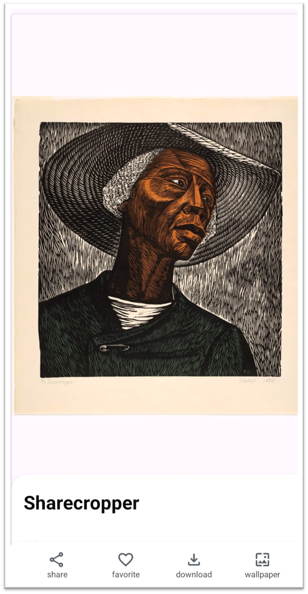 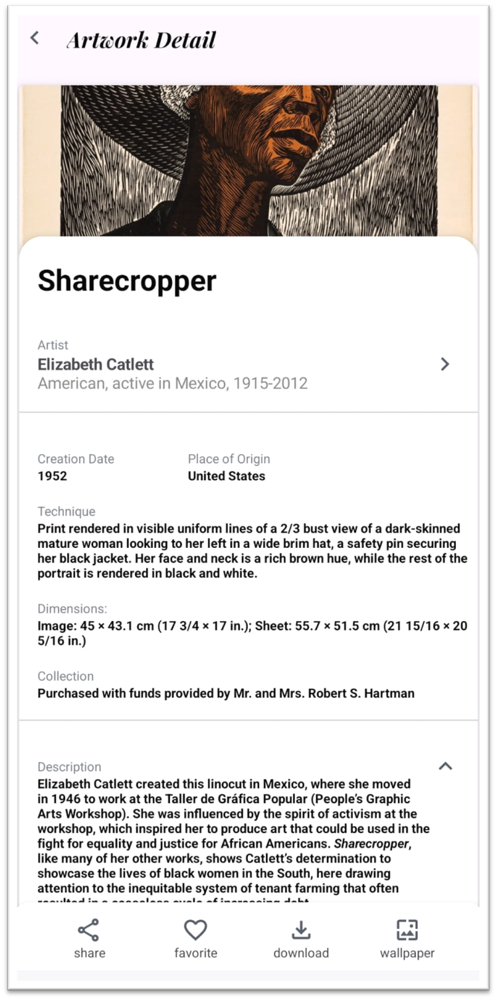

### 🔍 Full Screen Ekranı
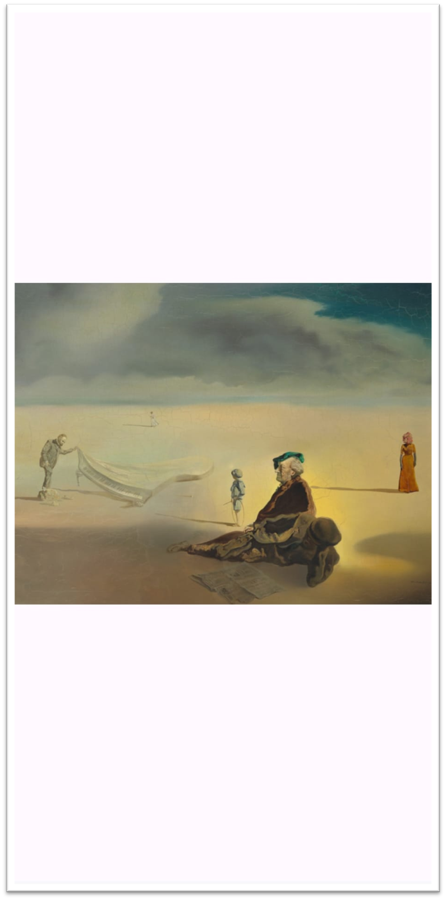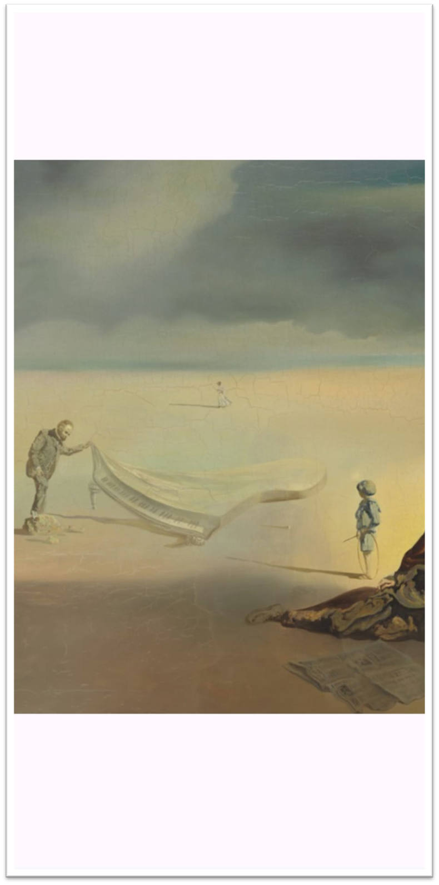

### 👩‍🎨 Artist Detail Ekranı
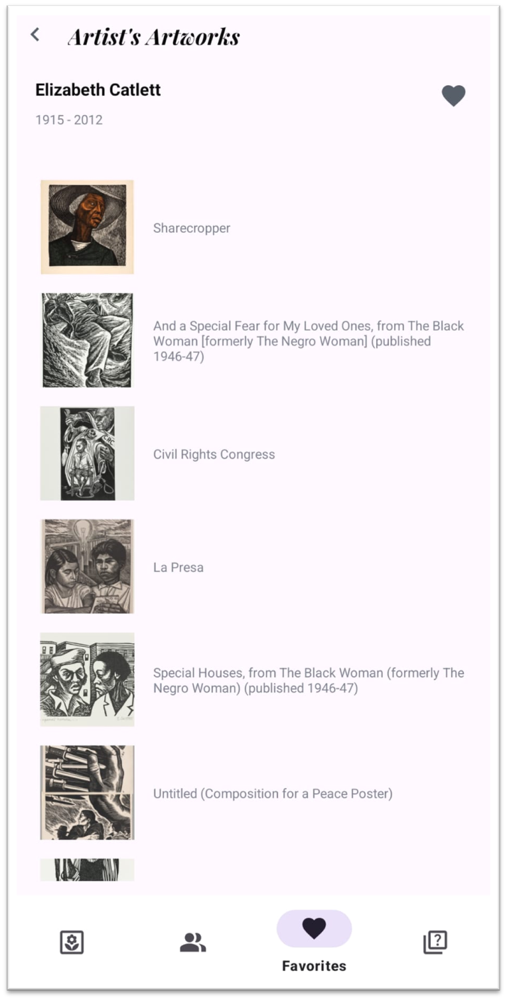

### 🕹 Game Ekranı
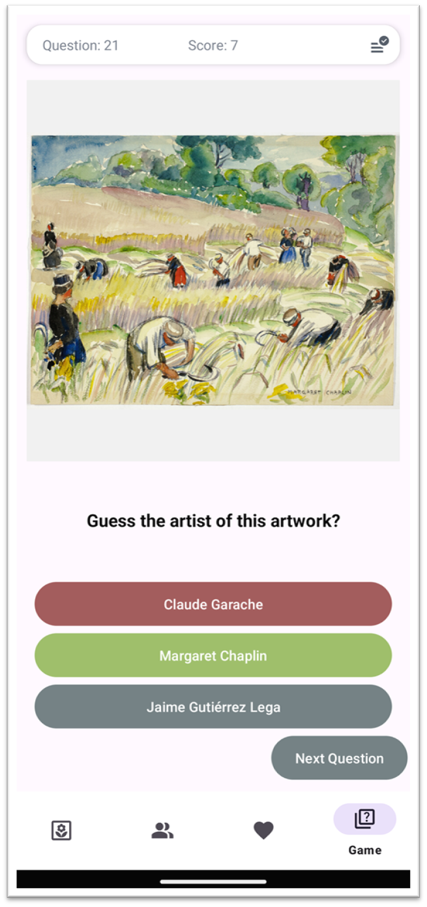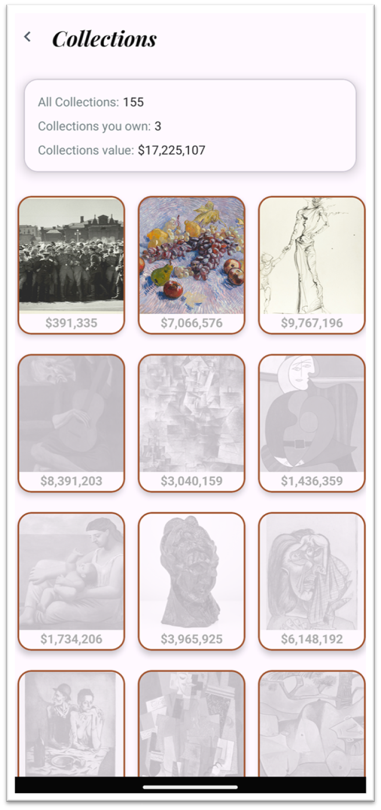

### 🌐 WebView Ekranı
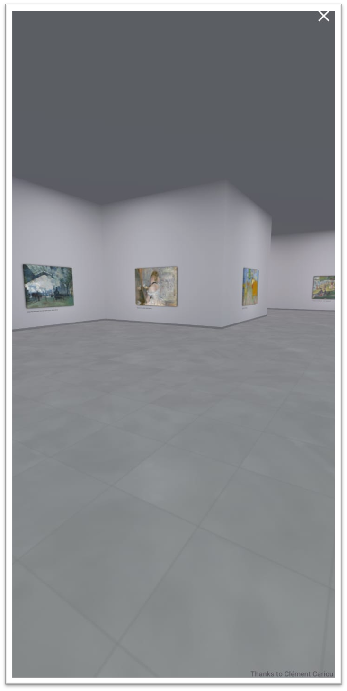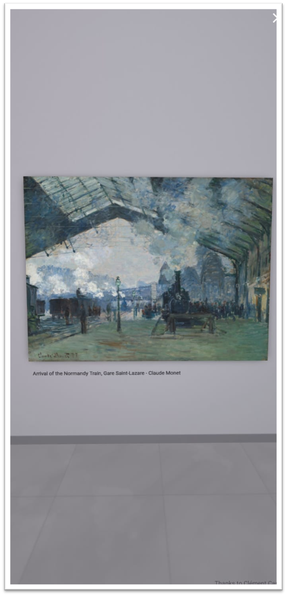


## 📌 Projede Kullandığım Teknolojiler

### 🔧 Temel Teknolojiler
- **Retrofit** - API çağrıları
- **ViewModel & LiveData** - State yönetimi
- **Coroutines** - Asenkron işlemler
- **Coil** - Görsel yükleme
- **SharedPreferences** - Yerel veri saklama
- **Gson** - JSON parsing

### 🎨 UI & UX
- **Material Design Components** - Modern arayüz
- **PhotoView** - Zoom destekli görüntüleme
- **Navigation Component** - Ekran navigasyonu
- **BottomNavigationView** - Alt navigasyon
- **RecyclerView, ConstraintLayout, CardView** - Layout bileşenleri
- **Shimmer** - Loading animasyonları
- **Dark Theme** - Karanlık tema desteği

### 🚀 Gelişmiş Özellikler
- **Pagination** - Sayfalama
- **ListAdapter** - Liste yönetimi
- **WebView** - Web içerik görüntüleme
- **Empty View** - Boş durum gösterimi
- **Error State** - Hata durumu yönetimi

---
## 🏗️ Proje Yapısı

```
📁 app/src/main/java/com/esmanureral/artframe/
├── 🎯 MainActivity.kt               
├── 📱 presentation/                  
│   ├── 🖼️ artwork/                  
│   ├── 🔍 artworkdetail/           
│   ├── 👨‍🎨 artistlist/              
│   ├── 📋 artistdetail/            
│   ├── ❤️ favorites/                
│   ├── 🎮 game/                   
│   └── 🏛️ virtual/                 
├── 💾 data/                      
│   ├── 🌐 network/                
│   └── 💿 local/                
└── 🛠️ utils/                      
```
## 🌐 API

- Art Institute of Chicago API kullanılarak gerçek sanat eseri verileri çekilmektedir.

<div align="center">

### ⭐ Bu projeyi beğendiyseniz yıldız vermeyi unutmayın!

**ArtFrame** ile sanatın büyülü dünyasını keşfedin! 🎨✨

</div>

